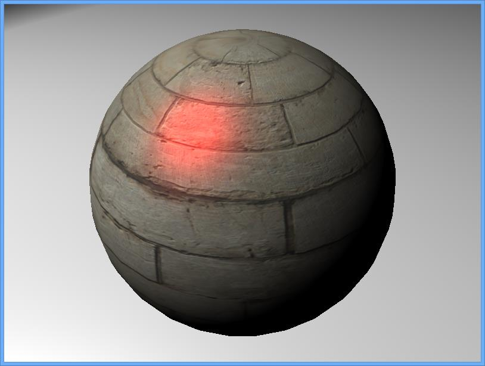
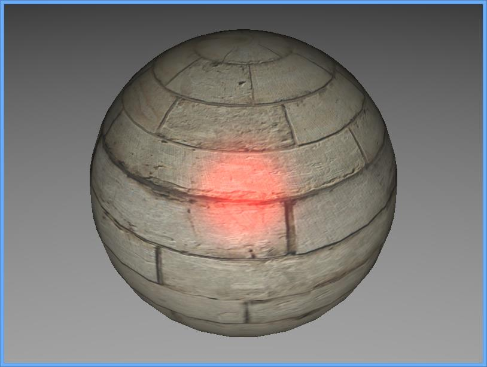
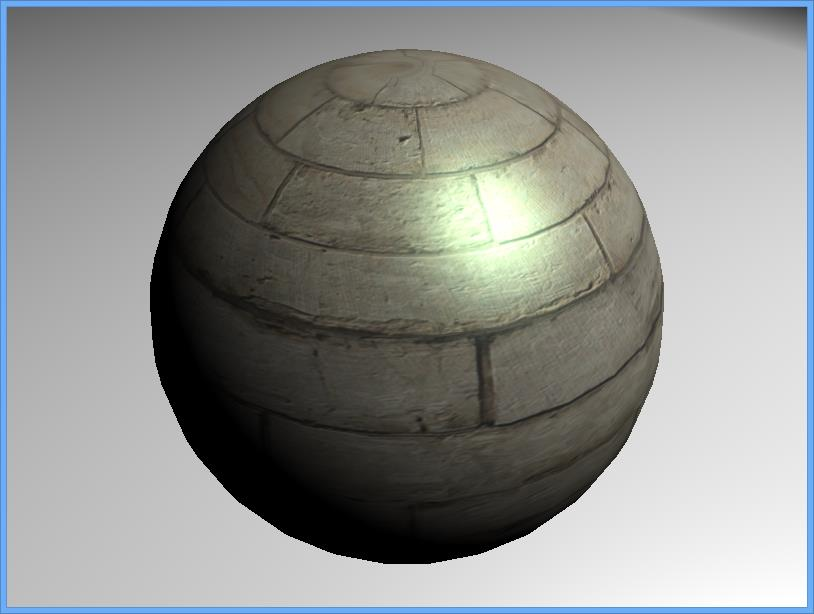
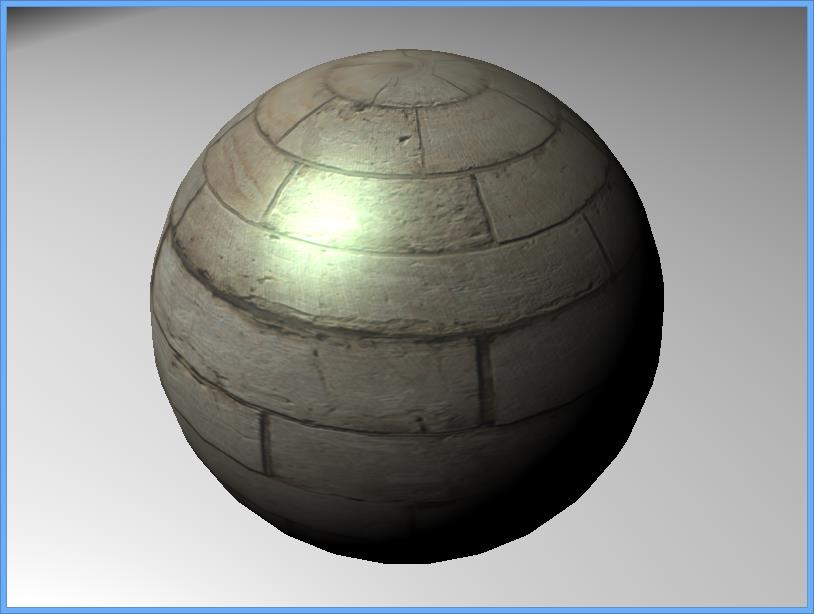
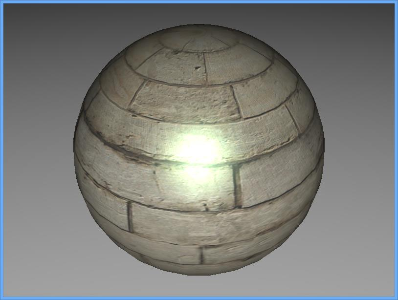
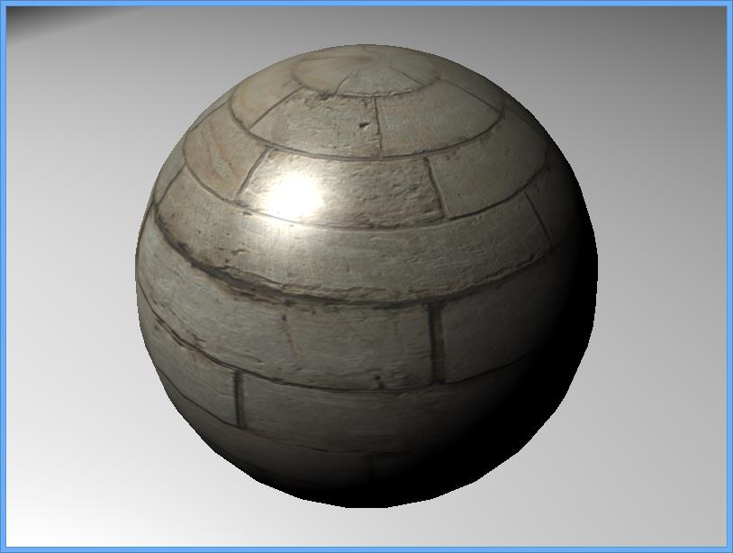
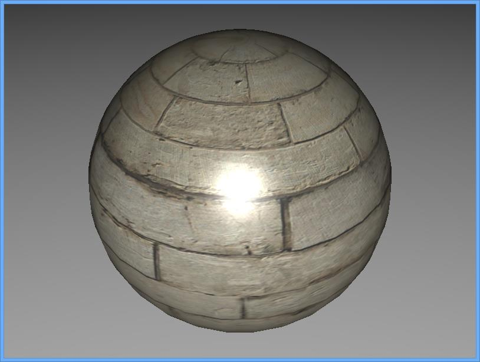
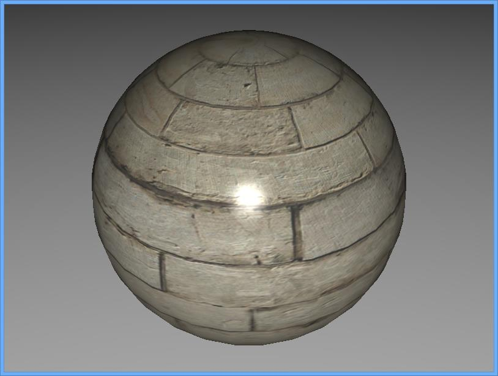

In this tutorial, we will introduce how to work with the `PhongMaterial` to achieve lights dependent rendering. In order to fully understand this example, please read this one first : [Working with the BasicMaterial](../tutorial/10-Working_with_the_BasicMaterial.md)

Step 0: Setup the scene
-----------------------

First of all, a `PhongMaterial` needs at least one light in the scene, otherwise it will appear totally black:

-   directional light: [Working with directional lights](../tutorial/26-Working_with_directional_lights.md)
-   spot light: [Working with spot lights](../tutorial/28-Working_with_spot_lights.md)
-   point light: [Working with point lights](../tutorial/27-Working_with_point_lights.md)

Secondly the `Phong.effect` must be added to the assets loading queue:

```cpp
sceneManager->assets()->loader()->queue("effect/Phong.effect");
```


Let's setup the scene:

```cpp
/*
Copyright (c) 2016 Aerys

Permission is hereby granted, free of charge, to any person obtaining a copy of this software and
associated documentation files (the "Software"), to deal in the Software without restriction,
including without limitation the rights to use, copy, modify, merge, publish, distribute,
sublicense, and/or sell copies of the Software, and to permit persons to whom the Software is
furnished to do so, subject to the following conditions:

The above copyright notice and this permission notice shall be included in all copies or
substantial portions of the Software.

THE SOFTWARE IS PROVIDED "AS IS", WITHOUT WARRANTY OF ANY KIND, EXPRESS OR IMPLIED, INCLUDING
BUT NOT LIMITED TO THE WARRANTIES OF MERCHANTABILITY, FITNESS FOR A PARTICULAR PURPOSE AND
NONINFRINGEMENT. IN NO EVENT SHALL THE AUTHORS OR COPYRIGHT HOLDERS BE LIABLE FOR ANY CLAIM,
DAMAGES OR OTHER LIABILITY, WHETHER IN AN ACTION OF CONTRACT, TORT OR OTHERWISE, ARISING FROM,
OUT OF OR IN CONNECTION WITH THE SOFTWARE OR THE USE OR OTHER DEALINGS IN THE SOFTWARE.
*/

#include "minko/Minko.hpp"
#include "minko/MinkoSDL.hpp"
#include "minko/MinkoPNG.hpp"

using namespace minko;
using namespace minko::math;
using namespace minko::component;

const int WINDOW_WIDTH = 800;
const int WINDOW_HEIGHT = 600;

int	main(int argc, char** argv)
{
	auto canvas = Canvas::create("Tutorial - Working with the BasicMaterial", WINDOW_WIDTH, WINDOW_HEIGHT);
	auto sceneManager = component::SceneManager::create(canvas);

	sceneManager->assets()->loader()->options()
		->registerParser<file::PNGParser>("png");

	sceneManager->assets()->loader()
		->queue("effect/Phong.effect");

	auto root = scene::Node::create("root")
		->addComponent(sceneManager);

	auto camera = scene::Node::create("camera")
		->addComponent(Renderer::create(0x00000000))
		->addComponent(Transform::create(inverse(lookAt(vec3(0.f, 1.f, 1.3f), vec3(), vec3(0.f, 1.f, 0.f)))))
		->addComponent(PerspectiveCamera::create((float)WINDOW_WIDTH / (float)WINDOW_HEIGHT, (float)M_PI * 0.25f, .1f, 1000.f));

	auto spotLight = scene::Node::create("spotLight")
		->addComponent(SpotLight::create(.6f, .78f, 20.f))
		->addComponent(Transform::create(inverse(lookAt(vec3(3.f, 5.f, 1.5f), vec3(), vec3(0.f, 1.f, 0.f)))));
	spotLight->component<SpotLight>()->diffuse();

	root->addChild(spotLight);
	root->addChild(camera);

	auto complete = sceneManager->assets()->loader()->complete()->connect([&](file::Loader::Ptr loader)
	{

	});

	sceneManager->assets()->loader()->load();

	auto enterFrame = canvas->enterFrame()->connect([&](Canvas::Ptr canvas, float t, float dt)
	{
		sceneManager->nextFrame(t, dt);
	});

	canvas->run();

	return 0;
}
```


To create a phong material you must use the `material::PhongMaterial::create()` method:
```cpp
auto phongMaterial = material::PhongMaterial::create();
```


Don't forget to use the `material::` prefix since the `PhongMaterial` class is defined in the `minko::material` namespace (and assuming you are already using the `minko` namespace).

The phong material uses the bindings listed in the `Phong.effect`.

Step 1: Configure the PhongMaterial
-----------------------------------

As the `BasicMaterial`, a `PhongMaterial` defines `diffuseColor` and `diffuseMap` methods:

-   `PhongMaterial::diffuseColor(math::vec4 color)`, where color is an RGBA Vector4 value
-   `PhongMaterial::diffuseColor(uint color)`, where rgba is an RGBA formatted unsigned integer value
-   `PhongMaterial::diffuseMap(AbstractTexture::Ptr texture)` [Loading and using textures](../tutorial/15-Loading_and_using_textures.md)

The `PhongMaterial` is a `data::ArrayProvider` with a set of user-friendly inlined getter/setters for the properties expected by the corresponding effect.

```cpp
sceneManager->assets()->loader()->queue(MYTEXTURE)

// inside the handler of assets->complete signal

auto phongMaterial = material::PhongMaterial::create();

phongMaterial->diffuseColor(0xff0000ff);
	// OR
phongMaterial->diffuseMap(sceneManager->assets()->texture(MYTEXTURE));
```


Once a `diffuseMap` is set, it overwrites the `diffuseColor`.

| Right                                                                                    | Left                                                                       | Front                                                                        |
|------------------------------------------------------------------------------------------|----------------------------------------------------------------------------|------------------------------------------------------------------------------|
|  |  |  |

Step 2: Setting a specular color
--------------------------------

Specular highlights are important in 3D engine, they provide visual information about:

-   the shape and aspect of a 3D object
-   the position of a 3D object according to the different light sources

The specular color changes the color of this hightlights. The default value is white.

The phong material class defines several methods to set the specular color:

-   `PhongMaterial::specularColor(math::vec4 color)`
-   `PhongMaterial::specularColor(uint color)`

```cpp
phongMaterial->specularColor(0xFF0000FF);
	// OR
phongMaterial->specularColor(vec4(1.f, 0.f, 0.f, 1.f));
```


| Specular Color | Right                                                                        | Left                                                                         | Front                                                                        |
|----------------|------------------------------------------------------------------------------|------------------------------------------------------------------------------|------------------------------------------------------------------------------|
| 0xFF0000FF     |      |      |      |
| 0xC0FFC0FF     |  |  |  |

Those images show one important thing: if one of the color components is zero, the specular color won't reach white.

Step 3: Setting the shininess
-----------------------------

Empirically, the shininess parameter controls how sharp specular reflections will look across the surface of the object. The default value is 8.

To set the shininess, the `PhongMaterial` defines one method :

-   `PhongMaterial::shininess(float shininess)`

Usually shininess is a power of two.

```cpp
phongMaterial->shininess(32.f);
```


| shininess | Right                                                                      | Left                                                                       | Front                                                                      |
|-----------|----------------------------------------------------------------------------|----------------------------------------------------------------------------|----------------------------------------------------------------------------|
| 2         |  |  |  |
| 16        |    |    |    |
| 64        |    |    |    |

Final Code
----------

```cpp
/*
Copyright (c) 2016 Aerys

Permission is hereby granted, free of charge, to any person obtaining a copy of this software and
associated documentation files (the "Software"), to deal in the Software without restriction,
including without limitation the rights to use, copy, modify, merge, publish, distribute,
sublicense, and/or sell copies of the Software, and to permit persons to whom the Software is
furnished to do so, subject to the following conditions:

The above copyright notice and this permission notice shall be included in all copies or
substantial portions of the Software.

THE SOFTWARE IS PROVIDED "AS IS", WITHOUT WARRANTY OF ANY KIND, EXPRESS OR IMPLIED, INCLUDING
BUT NOT LIMITED TO THE WARRANTIES OF MERCHANTABILITY, FITNESS FOR A PARTICULAR PURPOSE AND
NONINFRINGEMENT. IN NO EVENT SHALL THE AUTHORS OR COPYRIGHT HOLDERS BE LIABLE FOR ANY CLAIM,
DAMAGES OR OTHER LIABILITY, WHETHER IN AN ACTION OF CONTRACT, TORT OR OTHERWISE, ARISING FROM,
OUT OF OR IN CONNECTION WITH THE SOFTWARE OR THE USE OR OTHER DEALINGS IN THE SOFTWARE.
*/

#include "minko/Minko.hpp"
#include "minko/MinkoSDL.hpp"
#include "minko/MinkoPNG.hpp"

using namespace minko;
using namespace minko::math;
using namespace minko::component;

const int WINDOW_WIDTH = 800;
const int WINDOW_HEIGHT = 600;

const std::string MYTEXTURE = "texture/diffuseMap.png";

int	main(int argc, char** argv)
{
	auto canvas = Canvas::create("Tutorial - Working with the PhongMaterial", WINDOW_WIDTH, WINDOW_HEIGHT);
	auto sceneManager = component::SceneManager::create(canvas);

	sceneManager->assets()->loader()->options()
		->registerParser<file::PNGParser>("png");

	sceneManager->assets()->loader()
		->queue("effect/Phong.effect")
		->queue(MYTEXTURE);

	auto root = scene::Node::create("root")
		->addComponent(sceneManager);

	auto camera = scene::Node::create("camera")
		->addComponent(Renderer::create(0x00000000))
		->addComponent(Transform::create(inverse(lookAt(vec3(0.f, 1.f, 1.3f), vec3(), vec3(0.f, 1.f, 0.f)))))
		->addComponent(PerspectiveCamera::create((float)WINDOW_WIDTH / (float)WINDOW_HEIGHT, (float)M_PI * 0.25f, .1f, 1000.f));

	auto spotLight = scene::Node::create("spotLight")
		->addComponent(SpotLight::create(.6f, .78f, 20.f))
		->addComponent(Transform::create(inverse(lookAt(vec3(3.f, 5.f, 1.5f), vec3(), vec3(0.f, 1.f, 0.f)))));
	spotLight->component<SpotLight>()->diffuse(0.5f);

	root->addChild(spotLight);
	root->addChild(camera);

	auto complete = sceneManager->assets()->loader()->complete()->connect([&](file::Loader::Ptr loader)
	{
		auto phongMaterial = material::PhongMaterial::create();

		phongMaterial->diffuseMap(sceneManager->assets()->texture(MYTEXTURE));
		phongMaterial->specularColor(vec4(.4f, .8f, 1.f, 1.f));
		phongMaterial->shininess(2.f);

		auto mesh = scene::Node::create("mesh")
			->addComponent(Transform::create(mat4() * scale(vec3(1.1f))))
			->addComponent(Surface::create(
				geometry::SphereGeometry::create(sceneManager->assets()->context()),
				phongMaterial,
				sceneManager->assets()->effect("effect/Phong.effect")
				));

		root->addChild(mesh);
	});

	sceneManager->assets()->loader()->load();

	auto enterFrame = canvas->enterFrame()->connect([&](Canvas::Ptr canvas, float t, float dt)
	{
		sceneManager->nextFrame(t, dt);
	});

	canvas->run();

	return 0;
}
```


Where to go from there
----------------------

This tutorial covers partially the possibilities of the `PhongMaterial`. To learn more about this material, these tutorials provide more information:

-   [ Working with normal maps ](../tutorial/12-Working_with_normal_maps.md)
-   [ Working with environment maps ](../tutorial/13-Working_with_environment_maps.md)
-   [ Working with specular maps](../tutorial/14-Working_with_specular_maps.md)
