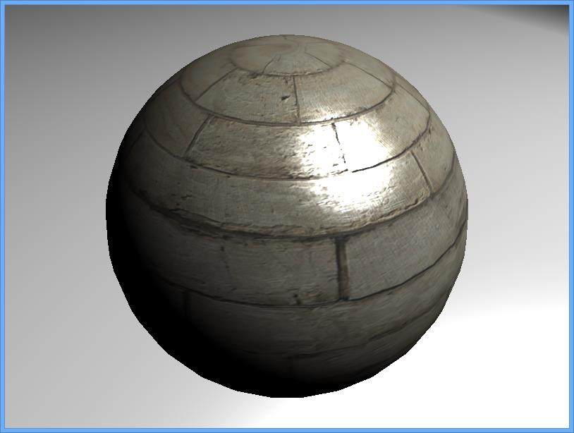
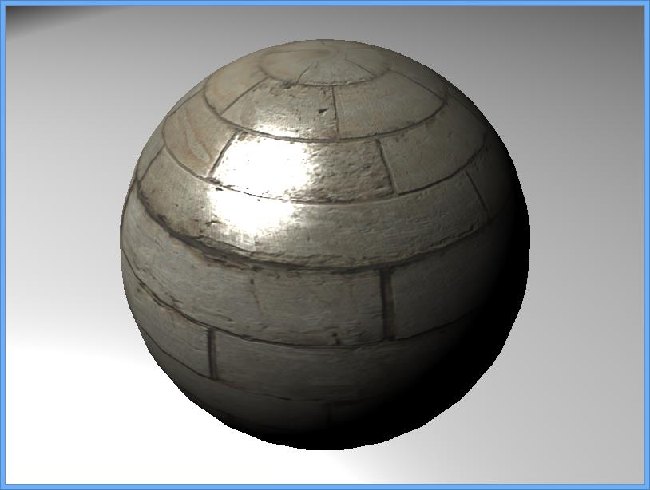
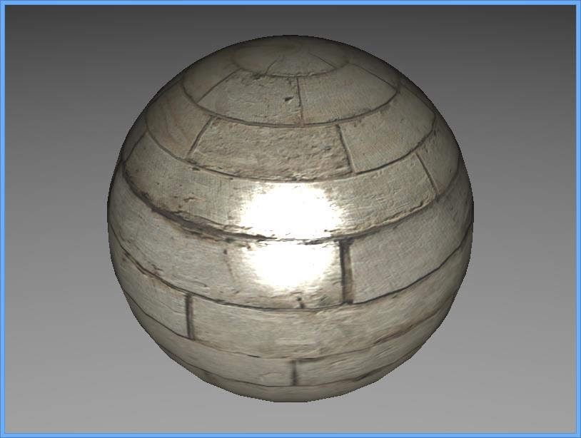
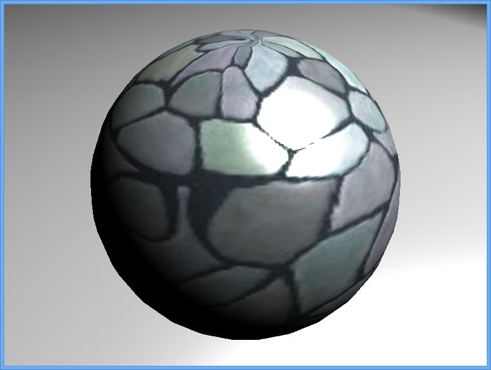
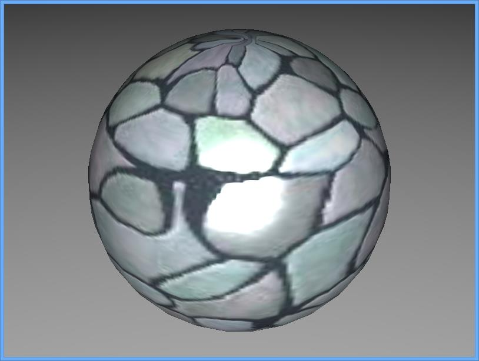
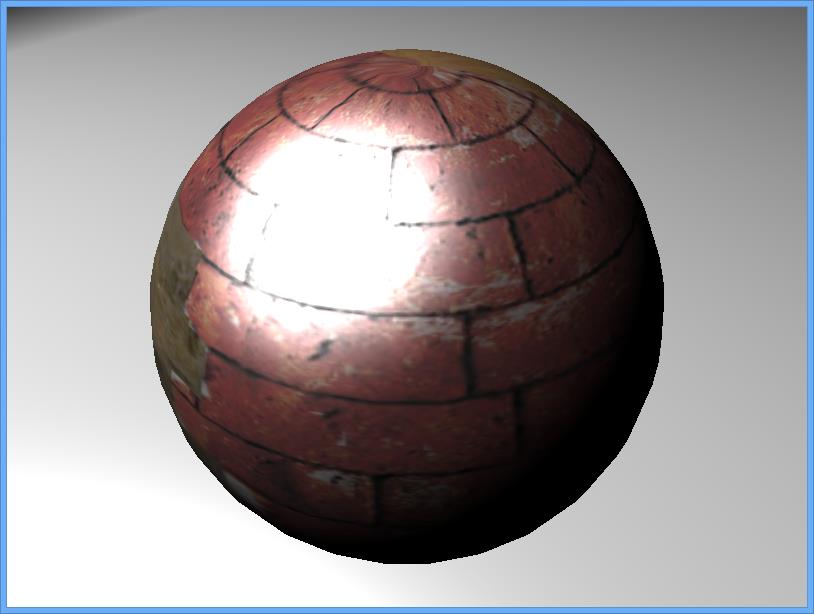
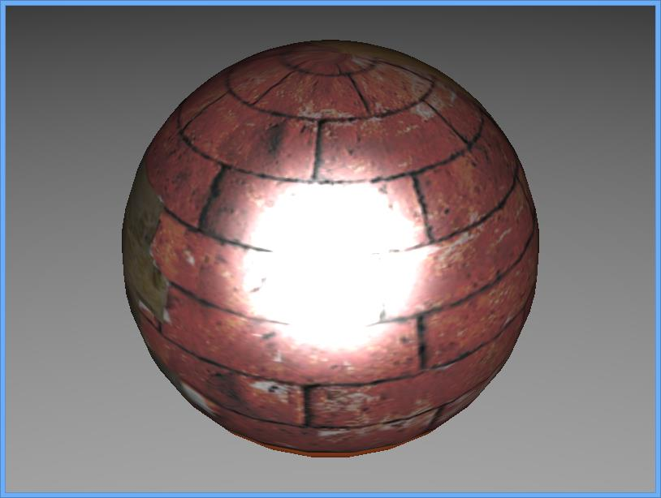

This tutorial will introduce specularMap and how to use it in your scene.

What is a specular map
----------------------

Specular maps are textures that define a surface's shininess and highlight color. The higher the value of a pixel (from black to white) is the shinier the surface will appear. The first noticeable effect is that the specular of the different lights (if the specular map is done correctly) will fit the ruggedness of the material.

Prerequisites
-------------

To fully understand the rest of the tutorial, you need to know how to setup a scene with a phong material, and how to load textures:

-   [Working with the PhongMaterial](../tutorial/11-Working_with_the_PhongMaterial.md)
-   [Loading and using textures](../tutorial/15-Loading_and_using_textures.md)

Step 0: Setup a scene
---------------------

The setup will be the same that the one at the end of the [Working with the PhongMaterial](../tutorial/11-Working_with_the_PhongMaterial.md) tutorial:

```cpp
/*
Copyright (c) 2016 Aerys

Permission is hereby granted, free of charge, to any person obtaining a copy of this software and
associated documentation files (the "Software"), to deal in the Software without restriction,
including without limitation the rights to use, copy, modify, merge, publish, distribute,
sublicense, and/or sell copies of the Software, and to permit persons to whom the Software is
furnished to do so, subject to the following conditions:

The above copyright notice and this permission notice shall be included in all copies or
substantial portions of the Software.

THE SOFTWARE IS PROVIDED "AS IS", WITHOUT WARRANTY OF ANY KIND, EXPRESS OR IMPLIED, INCLUDING
BUT NOT LIMITED TO THE WARRANTIES OF MERCHANTABILITY, FITNESS FOR A PARTICULAR PURPOSE AND
NONINFRINGEMENT. IN NO EVENT SHALL THE AUTHORS OR COPYRIGHT HOLDERS BE LIABLE FOR ANY CLAIM,
DAMAGES OR OTHER LIABILITY, WHETHER IN AN ACTION OF CONTRACT, TORT OR OTHERWISE, ARISING FROM,
OUT OF OR IN CONNECTION WITH THE SOFTWARE OR THE USE OR OTHER DEALINGS IN THE SOFTWARE.
*/

#include "minko/Minko.hpp"
#include "minko/MinkoSDL.hpp"
#include "minko/MinkoJPEG.hpp"

using namespace minko;
using namespace minko::math;
using namespace minko::component;

const int WINDOW_WIDTH = 800;
const int WINDOW_HEIGHT = 600;

const std::string MYTEXTURE = "texture/diffuseMap.jpg";

int	main(int argc, char** argv)
{
	auto canvas = Canvas::create("Tutorial - Working with the PhongMaterial", WINDOW_WIDTH, WINDOW_HEIGHT);
	auto sceneManager = component::SceneManager::create(canvas);

	sceneManager->assets()->loader()->options()
		->registerParser<file::JPEGParser>("jpg");

	sceneManager->assets()->loader()
		->queue("effect/Phong.effect")
		->queue(MYTEXTURE);

	auto root = scene::Node::create("root")
		->addComponent(sceneManager);

	auto camera = scene::Node::create("camera")
		->addComponent(Renderer::create(0x00000000))
		->addComponent(Transform::create(inverse(lookAt(vec3(0.f, 1.f, 1.3f), vec3(), vec3(0.f, 1.f, 0.f)))))
		->addComponent(PerspectiveCamera::create((float)WINDOW_WIDTH / (float)WINDOW_HEIGHT, (float)M_PI * 0.25f, .1f, 1000.f));

	auto spotLight = scene::Node::create("spotLight")
		->addComponent(SpotLight::create(.6f, .78f, 20.f))
		->addComponent(Transform::create(inverse(lookAt(vec3(3.f, 5.f, 1.5f), vec3(), vec3(0.f, 1.f, 0.f)))));
	spotLight->component<SpotLight>()->diffuse(0.5f);

	root->addChild(spotLight);
	root->addChild(camera);

	auto complete = sceneManager->assets()->loader()->complete()->connect([&](file::Loader::Ptr loader)
	{
		auto phongMaterial = material::PhongMaterial::create();

		phongMaterial->diffuseMap(sceneManager->assets()->texture(MYTEXTURE));
		phongMaterial->specularColor(vec4(.4f, .8f, 1.f, 1.f));
		phongMaterial->shininess(2.f);

		auto mesh = scene::Node::create("mesh")
			->addComponent(Transform::create(mat4() * scale(vec3(1.1f))))
			->addComponent(Surface::create(
				geometry::SphereGeometry::create(sceneManager->assets()->context()),
				phongMaterial,
				sceneManager->assets()->effect("effect/Phong.effect")
				));

		root->addChild(mesh);
	});

	sceneManager->assets()->loader()->load();

	auto enterFrame = canvas->enterFrame()->connect([&](Canvas::Ptr canvas, float t, float dt)
	{
		sceneManager->nextFrame(t, dt);
	});

	canvas->run();

	return 0;
}
```


Step 1: Setting a SpecularMap
-----------------------------

`specularMap` are images just like `diffuseMap`, so their loading workflow are identical.

```cpp
sceneManager->assets()->loader()->queue("texture/specularmap.jpg");
```


Then, the specular texture will be available in the `file::AssetsLibrary` once all files are loaded.

The `PhongMaterial` defines one method to set a `specularMap`:

-   `PhongMaterial::specularMap(AbstractTexture::Ptr texture)`

There is two types of texture : `Texture2D` and `CubeTexture` (listed in the `TextureType` enum). Currently only flat textures are supported as a value for `PhongMaterial::specularMap()`.

```cpp
phongMaterial->specularMap(sceneManager->assets()->texture("texture/specularmap.jpg"));
```
| DiffuseMap / SpecularMap | Right                                                                        | Left                                                                         | Front                                                                        |
|----------------|------------------------------------------------------------------------------|------------------------------------------------------------------------------|------------------------------------------------------------------------------|
|   |       |    |    |

| DiffuseMap / SpecularMap | Right                                                                        | Left                                                                         | Front                                                                        |
|----------------|------------------------------------------------------------------------------|------------------------------------------------------------------------------|------------------------------------------------------------------------------|
|    |       |    |      |

| DiffuseMap / SpecularMap | Right                                                                        | Left                                                                         | Front                                                                        |
|----------------|------------------------------------------------------------------------------|------------------------------------------------------------------------------|------------------------------------------------------------------------------|
|    |       |    |      |

Final Code
----------

```cpp
/*
Copyright (c) 2016 Aerys

Permission is hereby granted, free of charge, to any person obtaining a copy of this software and
associated documentation files (the "Software"), to deal in the Software without restriction,
including without limitation the rights to use, copy, modify, merge, publish, distribute,
sublicense, and/or sell copies of the Software, and to permit persons to whom the Software is
furnished to do so, subject to the following conditions:

The above copyright notice and this permission notice shall be included in all copies or
substantial portions of the Software.

THE SOFTWARE IS PROVIDED "AS IS", WITHOUT WARRANTY OF ANY KIND, EXPRESS OR IMPLIED, INCLUDING
BUT NOT LIMITED TO THE WARRANTIES OF MERCHANTABILITY, FITNESS FOR A PARTICULAR PURPOSE AND
NONINFRINGEMENT. IN NO EVENT SHALL THE AUTHORS OR COPYRIGHT HOLDERS BE LIABLE FOR ANY CLAIM,
DAMAGES OR OTHER LIABILITY, WHETHER IN AN ACTION OF CONTRACT, TORT OR OTHERWISE, ARISING FROM,
OUT OF OR IN CONNECTION WITH THE SOFTWARE OR THE USE OR OTHER DEALINGS IN THE SOFTWARE.
*/

#include "minko/Minko.hpp"
#include "minko/MinkoSDL.hpp"
#include "minko/MinkoJPEG.hpp"

using namespace minko;
using namespace minko::math;
using namespace minko::component;

const int WINDOW_WIDTH = 800;
const int WINDOW_HEIGHT = 600;

const std::string DIFFUSEMAP = "texture/diffuseMap.jpg";
const std::string SPECULARMAP = "texture/specularMap.jpg";

int    main(int argc, char** argv)
{
	auto canvas = Canvas::create("Tutorial - Working with the specular maps", WINDOW_WIDTH, WINDOW_HEIGHT);
	auto sceneManager = component::SceneManager::create(canvas);

	sceneManager->assets()->loader()->options()
		->registerParser<file::JPEGParser>("jpg");

	sceneManager->assets()->loader()
		->queue("effect/Phong.effect")
		->queue(SPECULARMAP)
		->queue(DIFFUSEMAP);

	auto root = scene::Node::create("root")
		->addComponent(sceneManager);

	auto camera = scene::Node::create("camera")
		->addComponent(Renderer::create(0x00000000))
		->addComponent(Transform::create(inverse(lookAt(vec3(0.f, 1.f, 1.3f), vec3(), vec3(0.f, 1.f, 0.f)))))
		->addComponent(PerspectiveCamera::create((float)WINDOW_WIDTH / (float)WINDOW_HEIGHT, (float)M_PI * 0.25f, .1f, 1000.f));

	auto spotLight = scene::Node::create("spotLight")
		->addComponent(SpotLight::create(.6f, .78f, 20.f))
		->addComponent(Transform::create(inverse(lookAt(vec3(3.f, 5.f, 1.5f), vec3(), vec3(0.f, 1.f, 0.f)))));

	spotLight->component<SpotLight>()->diffuse(0.5f);

	auto ambientLight = scene::Node::create("ambientLight")
		->addComponent(AmbientLight::create(.2f));

	ambientLight->component<AmbientLight>()->color(vec3(1.f, 1.f, 1.f));

	root->addChild(ambientLight);
	root->addChild(spotLight);
	root->addChild(camera);

	auto complete = sceneManager->assets()->loader()->complete()->connect([&](file::Loader::Ptr loader)
	{
		auto phongMaterial = material::PhongMaterial::create();

		phongMaterial->diffuseMap(sceneManager->assets()->texture(DIFFUSEMAP));
		phongMaterial->specularMap(sceneManager->assets()->texture(SPECULARMAP));
		phongMaterial->shininess(2.f);

		auto mesh = scene::Node::create("mesh")
			->addComponent(Transform::create(mat4() * scale(vec3(1.1f))))
			->addComponent(Surface::create(
				geometry::SphereGeometry::create(sceneManager->assets()->context()),
				phongMaterial,
				sceneManager->assets()->effect("effect/Phong.effect")
				));

		root->addChild(mesh);
	});

	sceneManager->assets()->loader()->load();

	auto enterFrame = canvas->enterFrame()->connect([&](Canvas::Ptr canvas, float t, float dt)
	{
		sceneManager->nextFrame(t, dt);
	});

	canvas->run();

	return 0;
}
```


Where to go from here
---------------------

`specularMap` can me mixed with `normalMap` ([Working with normal maps](../tutorial/12-Working_with_normal_maps.md)) and/or `environmentMap` ([Working with environment maps ](../tutorial/13-Working_with_environment_maps.md)) to produce great effect on your 3D models: [PhongMaterial reference full example](../article/PhongMaterial_reference.md#Full_Example).
