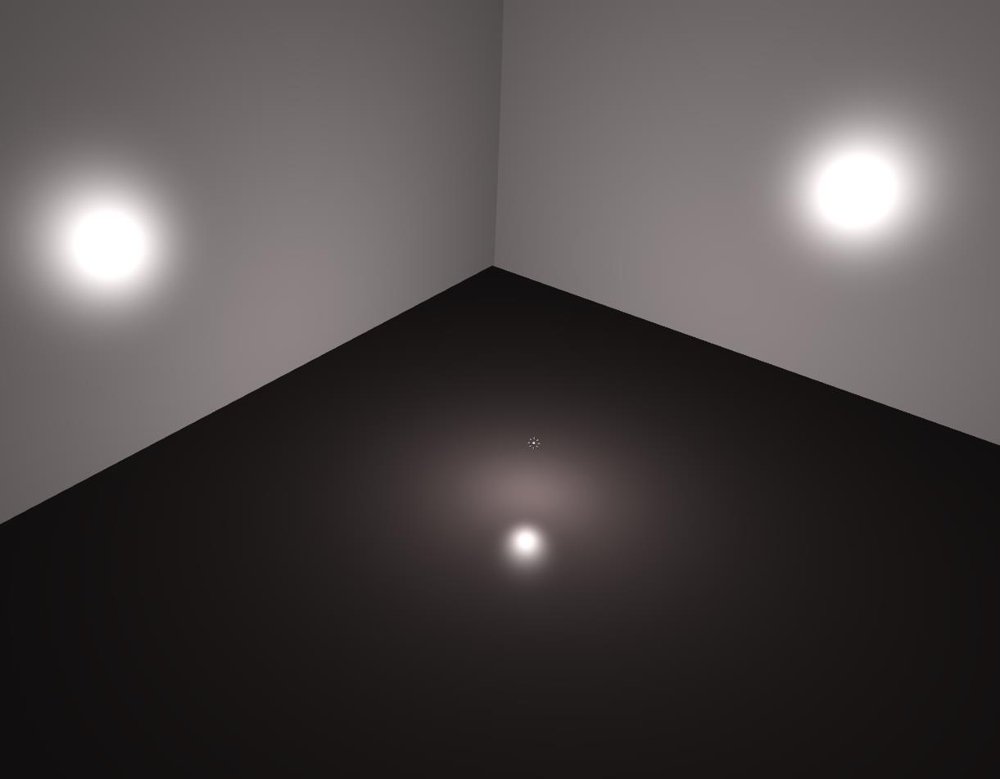

A point light casts illumination in every direction from a single point in 3D space. Point lights are useful for simulating any omnidirectional light source: Light-bulbs, candles, Christmas tree lights, gun-fire etc.



As the point light is emitting in every directions, his reflection can be multiple places in the environment.


In this more complex setup, you can see how multiple point lights render on a complex environment.

Step 1: Instantiate a point light
---------------------------------

The first very first thing you need to do is to include the following header to your .cpp file.

```cpp
#include <PointLight.hpp>
```


To create a new [PointLight](http://doc.v3.minko.io/reference/classminko_1_1component_1_1_point_light.html) object, we simply use the `PointLight::create(float attenuationDistance=-1.0f)` static method. The argument passed to the method is optional and defines the attenuation of the light emitted proportionally to the distance, the default value is -1.

Step 2: Adding a point light to the scene
-----------------------------------------

To add a point light to a scene, you have to understand that a `Scene` is a graph composed of one or more `Node`. Those nodes can contain elements that are called `Component`.

As a `PointLight` is a `Component` you'll have to follow this logic to create and add a light to a scene.

```cpp


 // Creating the Node
 auto pointLightNode = scene::Node::create("pointLight");

 // Adding the Component PointLight
 pointLightNode->addComponent(PointLight::create(0.1f));

// Adding the Node to the root of the scene graph
 root->addChild(pointLightNode);

```


As you can see in the code above, we first create a node named "pointLight" to which we add an instance of a point light. Of course you can chain those methods to perform actions in one line of code

```cpp


 // Creating the Node & adding the Component PointLight
 auto pointLightNode = scene::Node::create("pointLight")->addComponent(PointLight::create(0.1f));

```


Step 3: Change point light properties
-------------------------------------

you can directly change way the light appears by modifying it's public parameters, for example :

```cpp


auto pointLight = PointLight::create();

pointLight->diffuse(.4f);
pointLight->color(vec3(1.f, 0.f, 0.f));
```


Step 4: Remove a point light from the scene
-------------------------------------------

You may sometime need to remove a light from a scene, to do this you simply need to remove the point light from the `Node` it has been added to before.

```cpp


 // Adding an point light
 auto pointLightNode = scene::Node::create("pointLight")->addComponent(PointLight::create(0.1f));

 // retrieving the component
 auto pointLight = pointLightNode->component<PointLight>(0);

 // Remove the component from the node
 pointLightNode->removeComponent(pointLight);

```


As you can see above, the first step is to retrieve the light component with previously created and then remove it from the `Node`

Final code
----------

```cpp
/*
Copyright (c) 2016 Aerys

Permission is hereby granted, free of charge, to any person obtaining a copy of this software and
associated documentation files (the "Software"), to deal in the Software without restriction,
including without limitation the rights to use, copy, modify, merge, publish, distribute,
sublicense, and/or sell copies of the Software, and to permit persons to whom the Software is
furnished to do so, subject to the following conditions:

The above copyright notice and this permission notice shall be included in all copies or
substantial portions of the Software.

THE SOFTWARE IS PROVIDED "AS IS", WITHOUT WARRANTY OF ANY KIND, EXPRESS OR IMPLIED, INCLUDING
BUT NOT LIMITED TO THE WARRANTIES OF MERCHANTABILITY, FITNESS FOR A PARTICULAR PURPOSE AND
NONINFRINGEMENT. IN NO EVENT SHALL THE AUTHORS OR COPYRIGHT HOLDERS BE LIABLE FOR ANY CLAIM,
DAMAGES OR OTHER LIABILITY, WHETHER IN AN ACTION OF CONTRACT, TORT OR OTHERWISE, ARISING FROM,
OUT OF OR IN CONNECTION WITH THE SOFTWARE OR THE USE OR OTHER DEALINGS IN THE SOFTWARE.
*/

#include "minko/Minko.hpp"
#include "minko/MinkoSDL.hpp"

using namespace minko;
using namespace minko::math;
using namespace minko::component;

const math::uint WINDOW_WIDTH = 800;
const math::uint WINDOW_HEIGHT = 600;

int	main(int argc, char** argv)
{
	auto canvas = Canvas::create("Tutorial - Working with point light", WINDOW_WIDTH, WINDOW_HEIGHT);
	auto sceneManager = component::SceneManager::create(canvas);

	sceneManager->assets()->loader()
		->queue("effect/Phong.effect");

	auto root = scene::Node::create("root")
		->addComponent(sceneManager);

	auto camera = scene::Node::create("camera")
		->addComponent(Renderer::create(0x7f7f7fff))
		->addComponent(Transform::create(inverse(lookAt(vec3(0.f, 1.5f, 2.3f), vec3(), vec3(0.f, 1.f, 0.f)))))
		->addComponent(PerspectiveCamera::create((float)WINDOW_WIDTH / (float)WINDOW_HEIGHT, (float)M_PI * 0.25f, .1f, 1000.f));

	root->addChild(camera);

	auto ground = scene::Node::create("ground");
	auto leftWall = scene::Node::create("leftWall");
	auto rightWall = scene::Node::create("rightWall");
	auto backWall = scene::Node::create("backWall");
	auto pointLight = scene::Node::create("pointLight");

	auto complete = sceneManager->assets()->loader()->complete()->connect([&](file::Loader::Ptr loader)
	{
		ground->addComponent(Surface::create(
			geometry::QuadGeometry::create(sceneManager->assets()->context()),
			material::BasicMaterial::create()->diffuseColor(vec4(1.f, .5f, .5f, 1.f)),
			sceneManager->assets()->effect("effect/Phong.effect")
			))
			->addComponent(Transform::create(scale(vec3(4.f)) * rotate(static_cast<float>(-M_PI_2), vec3(1.f, 0.f, 0.f))));

		leftWall->addComponent(Surface::create(
			geometry::QuadGeometry::create(sceneManager->assets()->context()),
			material::BasicMaterial::create()->diffuseColor(vec4(.5f, .5f, .5f, 1.f)),
			sceneManager->assets()->effect("effect/Phong.effect")
			))
			->addComponent(Transform::create(translate(vec3(-1.f, 0.f, 0.f)) * (scale(vec3(4.f)) * rotate(static_cast<float>(M_PI_2), vec3(0.f, 1.f, 0.f)))));

		rightWall->addComponent(Surface::create(
			geometry::QuadGeometry::create(sceneManager->assets()->context()),
			material::BasicMaterial::create()->diffuseColor(vec4(.5f, .5f, .5f, 1.f)),
			sceneManager->assets()->effect("effect/Phong.effect")
			))
			->addComponent(Transform::create(translate(vec3(1.f, 0.f, 0.f)) * (scale(vec3(4.f)) * rotate(static_cast<float>(-M_PI_2), vec3(0.f, 1.f, 0.f)))));

		backWall->addComponent(Surface::create(
			geometry::QuadGeometry::create(sceneManager->assets()->context()),
			material::BasicMaterial::create()->diffuseColor(vec4(.5f, .5f, .5f, 1.f)),
			sceneManager->assets()->effect("effect/Phong.effect")
			))
			->addComponent(Transform::create(translate(vec3(0.f, 0.f, -1.f)) * scale(vec3(4.f))));

		pointLight->addComponent(Transform::create(translate(vec3(-.5f, 0.3f, 0.f))));
		pointLight->addComponent(PointLight::create()
			->diffuse(0.8f)
			->color(vec3(0.5f, 0.5f, 1.f)));

		root->addChild(ground);
		root->addChild(leftWall);
		root->addChild(rightWall);
		root->addChild(backWall);

		root->addChild(pointLight);
	});

	sceneManager->assets()->loader()->load();

	auto enterFrame = canvas->enterFrame()->connect([&](Canvas::Ptr canvas, float t, float dt)
	{
		sceneManager->nextFrame(t, dt);
	});

	canvas->run();

	return 0;
}
```
