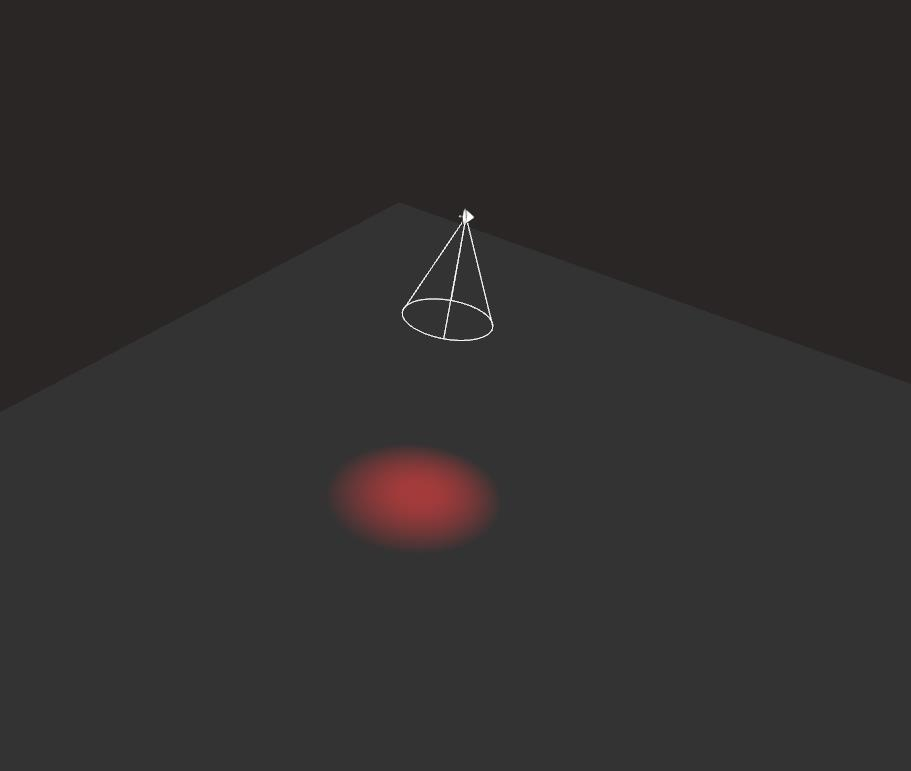

Spot lights are rather similar to their real-world counterparts. A spot light emits a cone shaped light field from a single point in space. Spotlights are often used for three-point studio lighting, and also for simulating any light fixture where there is a distinct visual falloff from light to dark—streetlights, desk lamps, overhead cone lighting, etc.

Let's start with something simple, a red spot light, emitting to the ground. as the widget imply, the light is only spread in one direction.



This setup is a little more complex, it introduces multiple spot lights emitting on a complex object with shadows enabled. As you can see with the yellowish light, the light attenuate with the distance, the closer the object is from the spot light, the stronger the light light will be.


Step 1: Instantiate a spot light
--------------------------------

The first very first thing you need to do is to include the following header to your .cpp file.

```cpp
#include <SpotLight.hpp>
```


To create a new [SpotLight](http://doc.v3.minko.io/reference/classminko_1_1component_1_1_spot_light.html) object, we simply use the `PointLight::create` static method.

The create method needs at least two arguments to be instantiated :

-   float *innerAngleRadians*: defines the inner angle for the cone of light
-   float *outerAngleRadians*: defines the outer angle for the cone of light
-   **(optional)** float *attenuationDistance* : defines the attenuation of the light emitted proportionally to the distance

Step 2: Adding a spot light to the scene
----------------------------------------

To add a point light to a scene, you have to understand that a `Scene` is a graph composed of one or more `Node`. Those nodes can contain elements that are called `Component`.

As a `SpotLight` is a `Component` you'll have to follow this logic to create and add a light to a scene.

```cpp


 // Creating the Node
 auto spotLightNode = scene::Node::create("spotLight");

 // Adding the Component SpotLight
 spotLightNode->addComponent(SpotLight::create(.15f, .4f));

  // Adding the Node to the root of the scene graph
 root->addChild(spotLightNode);

```


As you can see in the code above, we first create a node named "spotLight" to which we add an instance of a spot light. Of course you can chain those methods to perform all in one line of code

```cpp


 // Creating the Node & adding the Component SpotLight
 auto spotLightNode = scene::Node::create("spotLight")->addComponent(SpotLight::create(.15f, .4f));

```


Step 3: Change spot light properties
------------------------------------

you can directly change way the light appears by modifying it's public parameters, for example :
```cpp


 auto spotLight = SpotLight::create(.15f, .4f);
 spotLight->diffuse(.4f);

```


Step 4: Adjust a spot light
---------------------------

Once the light is created you might want to turn the spot light toward a direction. To do this you need to add a transformation matrix to the Node holding your spot light.

```cpp
auto spotLight = scene::Node::create("spotLight")

       ->addComponent(SpotLight::create(.15f, .4f))
       ->addComponent(Transform::create(inverse(lookAt(vec3(15.f, 20.f, 0.f), vec3(), vec3(0.f, 1.f, 0.f)))));

```


Step 5: Remove a spot light from the scene
------------------------------------------

You may sometime need to remove a light from a scene, to do this you simply need to remove the spot light from the `Node` it has been added to before.

```cpp


 // Adding an spot light
 auto spotLightNode = scene::Node::create("spotLight")->addComponent(SpotLight::create(.15f, .4f));

 // retrieving the component
 auto spotLight = spotLightNode->component<SpotLight>(0);

 // Remove the component from the node
 spotLightNode->removeComponent(spotLight);

```


As you can see above, the first step is to retrieve the light component with previously created and then remove it from the `Node`

Final code
----------

```cpp
/*
Copyright (c) 2016 Aerys

Permission is hereby granted, free of charge, to any person obtaining a copy of this software and
associated documentation files (the "Software"), to deal in the Software without restriction,
including without limitation the rights to use, copy, modify, merge, publish, distribute,
sublicense, and/or sell copies of the Software, and to permit persons to whom the Software is
furnished to do so, subject to the following conditions:

The above copyright notice and this permission notice shall be included in all copies or
substantial portions of the Software.

THE SOFTWARE IS PROVIDED "AS IS", WITHOUT WARRANTY OF ANY KIND, EXPRESS OR IMPLIED, INCLUDING
BUT NOT LIMITED TO THE WARRANTIES OF MERCHANTABILITY, FITNESS FOR A PARTICULAR PURPOSE AND
NONINFRINGEMENT. IN NO EVENT SHALL THE AUTHORS OR COPYRIGHT HOLDERS BE LIABLE FOR ANY CLAIM,
DAMAGES OR OTHER LIABILITY, WHETHER IN AN ACTION OF CONTRACT, TORT OR OTHERWISE, ARISING FROM,
OUT OF OR IN CONNECTION WITH THE SOFTWARE OR THE USE OR OTHER DEALINGS IN THE SOFTWARE.
*/

#include "minko/Minko.hpp"
#include "minko/MinkoSDL.hpp"

using namespace minko;
using namespace minko::math;
using namespace minko::component;

const math::uint WINDOW_WIDTH = 800;
const math::uint WINDOW_HEIGHT = 600;

int	main(int argc, char** argv)
{
	auto canvas = Canvas::create("Tutorial - Working with spot lights", WINDOW_WIDTH, WINDOW_HEIGHT);
	auto sceneManager = component::SceneManager::create(canvas);

	sceneManager->assets()->loader()
		->queue("effect/Phong.effect");

	auto root = scene::Node::create("root")
		->addComponent(sceneManager);

	auto camera = scene::Node::create("camera")
		->addComponent(Renderer::create(0x7f7f7fff))
		->addComponent(Transform::create(inverse(lookAt(vec3(0.f, 1.5f, 2.3f), vec3(), vec3(0.f, 1.f, 0.f)))))
		->addComponent(PerspectiveCamera::create((float)WINDOW_WIDTH / (float)WINDOW_HEIGHT, (float)M_PI * 0.25f, .1f, 1000.f));

	root->addChild(camera);

	auto ground = scene::Node::create("ground");

	auto spotLight = scene::Node::create("spotLight")
		->addComponent(SpotLight::create(.6f, .78f, 20.f))
		->addComponent(Transform::create(inverse(lookAt(vec3(3.f, 5.f, 1.5f), vec3(), vec3(0.f, 1.f, 0.f)))));
	spotLight->component<SpotLight>()->diffuse(0.5f);

	root->addChild(spotLight);

	auto complete = sceneManager->assets()->loader()->complete()->connect([&](file::Loader::Ptr loader)
	{
		ground->addComponent(Surface::create(
			geometry::QuadGeometry::create(sceneManager->assets()->context()),
			material::BasicMaterial::create()->diffuseColor(vec4(1.f, .5f, .5f, 1.f)),
			sceneManager->assets()->effect("effect/Phong.effect")
			))
			->addComponent(Transform::create(scale(vec3(4.f)) * rotate(static_cast<float>(-M_PI_2), vec3(1.f, 0.f, 0.f))));

		root->addChild(ground);
	});

	sceneManager->assets()->loader()->load();

	auto enterFrame = canvas->enterFrame()->connect([&](Canvas::Ptr canvas, float t, float dt)
	{
		sceneManager->nextFrame(t, dt);
	});

	canvas->run();

	return 0;
}
```
