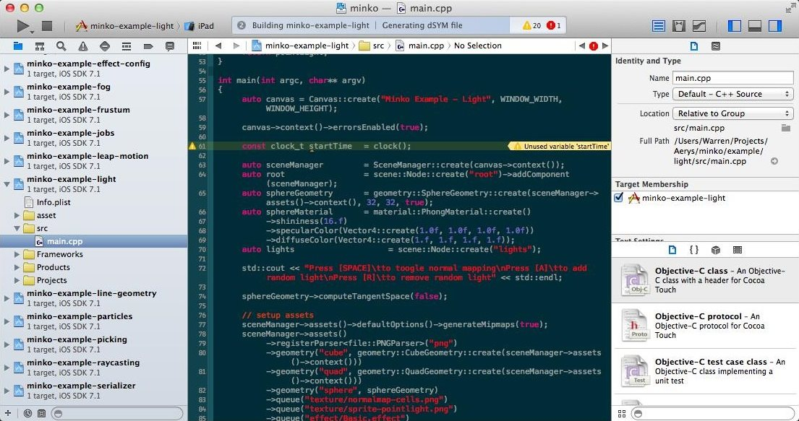

This tutorial requires that you have read [Create a new application](../tutorial/Create_a_new_application.md). We'll suppose your application is named `my-project`.

Step 1: Installing the toolchain
--------------------------------

Targetting iOS is **only available on OS X** at the moment.

We need to install [Xcode](https://developer.apple.com/xcode/). Xcode is available on the Mac App Store for free, which is the easiest way to get it.

Step 2: Generate the solution
-----------------------------

A script is provided to generate Xcode projects for iOS targets.

```bash
script/solution_xcode.sh 
```


Step 3: Build the solution
--------------------------

Open the `my-project.xcworkspace` by double-clicking on it.

The solution should immediately be ready to build. Select the product and the target (iOS Simulator iPad for instance), press the Play button and the build should start.



Step 4: Run the application
---------------------------

Running an application in Xcode is as easy as pressing the Play button. That should kick off the Simulator or push the build on the device.

Step 5: Clean the solution (optional)
-------------------------------------

To clean the build, you can use the built-in feature in Xcode.

If you also want to erase generated solution files (`Makefile`s), you can use a stronger command which will erase any ignored file (files matched by a pattern in `.gitignore`:

```bash
script/clean.sh 
```


Step 6: Support more targets (optional)
---------------------------------------

Your application should now target iOS in one click. You can also [turn your native application into an HTML5 one](../tutorial/Targeting_HTML5.md)!

